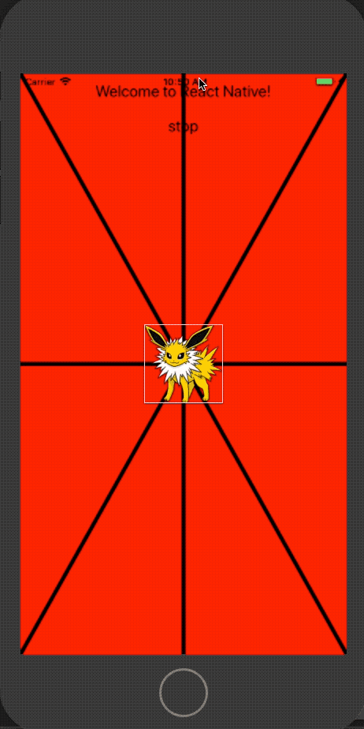

# react-native-sf-sprite


# 精灵控件,支持移动、放大、旋转、渐变动画,可以拖动
# 绘制图层,支持绘制线段、连续线段实现画笔功能





# 安装
* npm install react-native-sf-sprite


# IOS
Add the ART.xcodeproj (found in node_modules/react-native/Libraries/ART) to the Libraries group and add libART.a to Link Binary With Libraries under Build Phases.


# Props
# SFSprite
|  parameter  |  type  |  required  |   description  |  default  |
|:-----|:-----|:-----|:-----|:-----|
|tag|number|no|标签|0|
|source|uri/string|yes|图片资源||
|width|number|yes|图片宽度||
|height|number|yes|图高度||
|visible|boolean|no|是否显示|true|
|canDrag|boolean|no|是否可以拖拽移动|false|
|rotate|number|no|旋转度(0-360)|0|
|opacity|number|no|透明度(0-1)|1|
|x|number|no|坐标x|0|
|y|number|no|坐标y|0|
|anchorPointX|number|no|锚点x(0-1)|0.5|
|anchorPointY|number|no|锚点y(0-1)|0.5|
|scaleX|number|no|放大倍数x|1|
|scaleY|number|no|放大倍数y|1|
|resizeModel|string|no|图片显示模式'cover', 'contain', 'stretch', 'repeat', 'center'|'stretch'|
|showHitBox|bool|no|是否显示精灵碰撞框|false|
|showHitBoxColor|string|no|碰撞框颜色|'white'|
|onPress|func|no|点击事件(tag)|null|
|onPressIn|func|no|按下事件(tag)|null|
|onPressOut|func|no|抬起并不在精灵范围内事件(tag)|null|
|onMoveBegin|func|no|开始移动事件({touchX,touchY,tag})|null|
|onMove|func|no|移动事件({touchX,touchY,tag)|null|
|onMoveEnd|func|no|结束移动事件({touchX,touchY,tag)|null|

# SFDrawLayer
|  parameter  |  type  |  required  |   description  |  default  |
|:-----|:-----|:-----|:-----|:-----|
|x|number|no|画布x|0|
|y|number|no|画布y|0|
|width|number|no|画布宽度|屏幕宽度|
|height|number|no|画布高度|屏幕高度|


# Methods
# SFSprite
|  Methods  |  Params  |  Param Types  |   description  |  Example  |
|:-----|:-----|:-----|:-----|:-----|
|reset|||重置精灵||
|setEnable|value|bool|false:不可触发事件||
|setVisible|value|bool|设置隐藏||
|setPos|{x:,y:}|dic|设置位置||
|setPosX|{x:}|dic|设置位置x||
|setPosY|{y:}|dic|设置位置y||
|setScale|{x:,y:}||设置放大缩小||
|setScaleX|{x:}|dic|设置放大缩小x||
|setScaleY|{y:}|dic|设置放大缩小y||
|setRotate|{angle:}|dic|设置旋转角度(0-360)||
|setOpacity|{opacity:}|dic|设置透明度(0-1)||
|setAnchorPoint|{x:,y:}|dic|设置锚点(0-1)||
|setAnchorPointX|{x:}|dic|设置锚点x||
|setAnchorPointY|{y:}|dic|设置锚点y||
|getVisible|无|无|获取是否显示||
|getSize|无|无|获取精灵宽高||
|getPos|无|无|获取精灵位置||
|getPosX|无|无|获取位置x||
|getPosY|无|无|获取位置y||
|getPosRealX|无|无|获取实际位置x(由于锚点不一样,实际位置与显示位置不一样)||
|getPosRealY|无|无|获取实际位置y(由于锚点不一样,实际位置与显示位置不一样)||
|getPosReal|无|无|获取实际位置(由于锚点不一样,实际位置与显示位置不一样)||
|getScale|无|无|获取放大缩小||
|getScaleX|无|无|获取缩放x||
|getScaleY|无|无|获取缩放y||
|getRotate|无|无|获取角度||
|getOpacity|无|无|获取透明度||
|getAnchorPoint|无|无|获取锚点||
|getAnchorPointX|无|无|获取锚点x||
|getAnchorPointY|无|无|获取锚点y||
|setHitLines|pointAry,r|array,number|设置碰撞线段,碰撞半径。设置后碰撞后不可以超过线段||

# SFSprite-Animated (所有动画都需要调用run相应的函数去执行才能生效)
|  Methods  |  Params  |  Param Types  |   description  |  Example  |
|:-----|:-----|:-----|:-----|:-----|
|moveTo|{x:x, y:y, dur, easing:easing}||移动到指定位置||
|moveToX|{x:x, dur:dur, easing:easing}||移动到指定位置x||
|moveToY|{y:y, dur:dur, easing:easing}||移动到指定位置y||
|rotateTo|{angle:angle, dur:dur, easing:easing}||旋转||
|fadeIn|{dur:dur, easing:easing}||淡入||
|fadeOut|{dur:dur, easing:easing}||淡出||
|scalexTo|{scaleX:scaleX, dur:dur, from:from, easing:easing}||缩放到||
|scaleyTo|{scaleY:scaleY, dur:dur, from:from, easing:easing}||缩放到||
|scaleTo||{scaleX:scaleX, scaleY:scaleY, dur:dur, from:from, easing:easing}|缩放到||
|parallel|array||组合平行动画||
|sequence|array||组合顺序动画||
|run|ani, finish||执行单一动画||
|runParallel|aniAry, finish||同时执行多个动画||
|runSequence|aniAry, finish, loop = 1||顺序执行多个动画,可重复||
|stop|||停止动画||
|runRotateLoop|dur, finish, loop = 1||执行无限旋转动画||


# SFDrawLayer
|  Methods  |  Params  |  Param Types  |   description  |  Example  |
|:-----|:-----|:-----|:-----|:-----|
|drawLine|p1, p2, color, size||画线段||
|drawPathBegin|color, size||绘制连续线段起始,每次重新绘制都需要调用||
|drawPath|p||绘制连续线段||
|getLineKB|p1,p2||获取线性函数k,b系数||
|getPointByLineAndCircle|p1, p2, center, r||获取圆与直线的2个交点||
|setVisible|value||设置是否显示||
|setLineVisible|value||设置线段是否显示||
|setPathVisible|value||设置连续线段是否显示||


# 例子
```
import React, {Component} from 'react';
import {
    Platform,
    StyleSheet,
    Text,
    View,
    TouchableWithoutFeedback,
    ScrollView,
    findNodeHandle,
    Dimensions,
    Image
} from 'react-native';
import {SFSprite,SFDrawLayer} from "react-native-sf-sprite"
var width = Dimensions.get('window').width;
var height = Dimensions.get('window').height;

# 动画例子
var obj = this.sp;
var dur = 300;
obj.runSequence([//顺序执行动画
        obj.moveTo({x:width/2-200,y:100,dur:dur}),
        obj.moveTo({x:width/2-100,y:100,dur:dur}),
    ],(tag,finished)=>{//顺序执行结束回调
        obj.runParallel([//同时执行动画
            obj.moveTo({x:width/2,y:50,dur:dur}),
            obj.scaleTo({scaleX:0.5,scaleY:0.5,dur:dur})
        ],(tag,finished)=>{同时执行动画回调
            obj.setScale({x:0.5,y:0.5})
            //旋转动画
            obj.runRotateLoop(dur,()=>{
                obj.run(obj.scaleTo({scaleX:1,scaleY:1,dur:dur}),()=>{
                    obj.setScale({x:1.5,y:1.5});
                    obj.run(obj.moveTo({x:width/2,y:height/2,dur:dur}),()=>{
                        obj.runRotateLoop(300,()=>{},0)
                    })

                })

            },2);
        })

    },1)

//精灵绘制
<SFSprite
    ref={(ref)=> {this.sp = ref}}
    width={100}
    height={100}
    x={width/2}
    y={height/2}
    scaleX={1}
    scaleY={1}
    showHitBox={true}
    canDrag={true}
    onMove={this.onMove}
    onMoveBegin={this.onMoveBegin}
    anchorPointX={0.5}
    anchorPointY={0.5}
    onPress={()=>console.log('onPress')}
    onPressIn={()=>console.log('onPressIn')}
    onPressOut={()=>console.log('onPressOut')}
    source={require('./1.png')}/>


# 绘制例子

<SFDrawLayer ref={(ref)=>{this.draw = ref}}/>

//绘制线段
this.draw.drawLine({x:0,y:0},{x:width,y:height},'black',5);

//绘制连续线段
//在开始移动函数里调用
onMoveBegin = (data) => {
    this.draw.drawPathBegin('white',10);
}
//在移动函数里调用
onMove = (data) => {
    if (this.sp.checkLineIn({px1:0,py1:0,px2:width,py2:100})){//碰撞检测
        console.log('碰到线段')
    }
    //绘制连续线段
    this.draw.drawPath({x:data.touchX,y:data.touchY})
}
```
